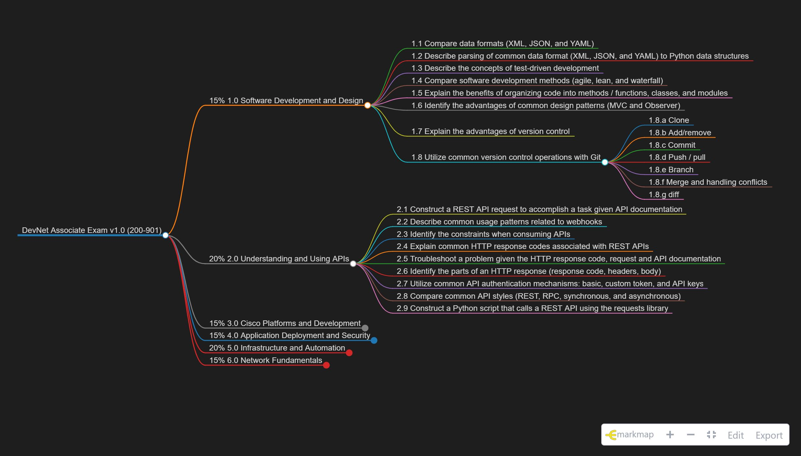

# CiscoExamPDFtoMindmap
A python script to convert the Cisco Exam Objectives PDF files to markdown format. This markdown file can be rendered into a nice mindmap using the Markmap VSCode extension. This repo should not be considered an up to date source for current exam objectives. For current Cisco exam offerings and their associated exam objectives please visit: https://www.cisco.com/c/en/us/training-events/training-certifications/exams/current-list.html



# Requirements

The script is dependent on PyPDF2 and you'll need the Markmap VSCode extension installed to render the MD files as mind maps.

Install PyPDF2:

```python -m pip install pypdf2```

Install Markmap VSCode extension:

- Launch VSCode
- Hit `Ctrl+Shift+X` to launch the Extension Marketplace
- Search for Markmap
- Install Markmap

# Known Issues

Some PDF files don't extact any readable text and as a result the script fails. I believe this has something to do with how the original PDF was generated. Overall I had pretty good success with the exception of a few exams. 


